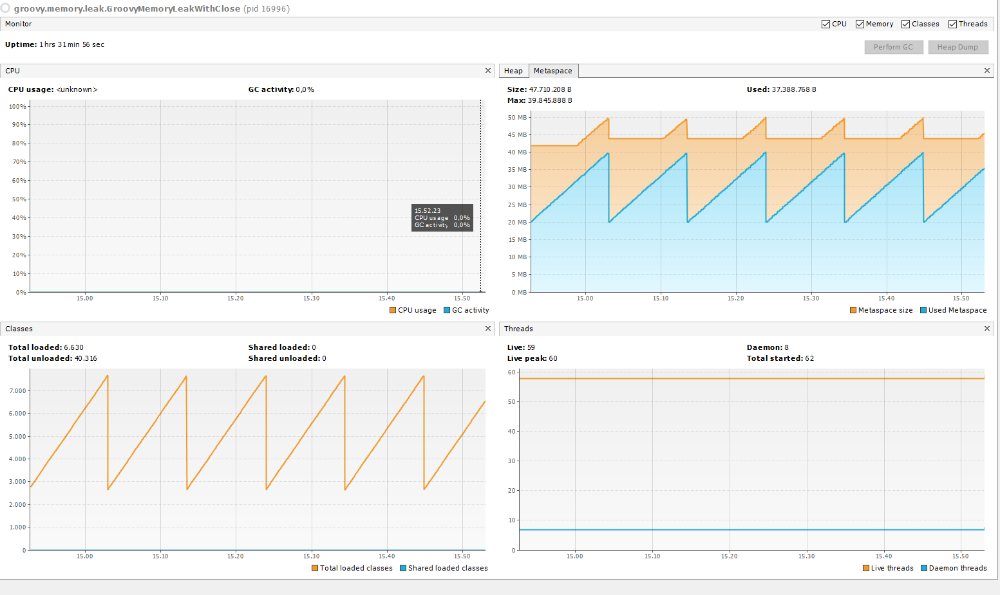

# Groovy Memory Leak

## VM Options

```
 -Dgroovy.use.classvalue=true 
 -XX:+ClassUnloadingWithConcurrentMark 
 -XX:+CMSScavengeBeforeRemark 
 -XX:+ScavengeBeforeFullGC 
 -XX:ParallelGCThreads=2 
 -XX:MetaspaceSize=50M 
 -XX:MaxMetaspaceSize=50M 
 -XX:CompressedClassSpaceSize=30M 
 -XX:MinMetaspaceFreeRatio=0 
 -XX:MaxMetaspaceFreeRatio=100
```

## Unsafe Groovy Script Execution
**Test executed with class GroovyMemoryLeakWithoutClose which execute a dynamic groovy script without nothing safely close operation**
```
    GroovyCodeSource groovyCodeSource = new GroovyCodeSource(script, "SCRIPT", GroovyShell.DEFAULT_CODE_BASE);
    GroovyClassLoader groovyClassLoader = new GroovyClassLoader();
    Class groovyClass = groovyClassLoader.parseClass(groovyCodeSource, false);
    Script groovyScript = InvokerHelper.createScript(groovyClass, binding);
    groovyScript.run();
```


## Safe Groovy Script Execution
**Test executed with class GroovyMemoryLeakWithClose which execute a dynamic groovy script with some safely close operation**

**Used these methods from GroovySystem at startup**
```
    GroovySystem.setKeepJavaMetaClasses(false);
    GroovySystem.stopThreadedReferenceManager();
```
A short description of follow code:
1. Create a temp file with the script groovy
2. Create an empty UrlClassLoader
3. Create a new GroovyClassLoader from UrlClassLoader
4. Load groovy script from file
5. Execute groovy script
6. Close all classloader
7. Delete the temp file
```
    String groovyFilename = "script-" + UUID.randomUUID() + ".groovy";
    FileOutputStream fileOutputStream = new FileOutputStream(groovyFilename);
    fileOutputStream.write(script.getBytes(StandardCharsets.UTF_8));
    fileOutputStream.close();

    GroovyCodeSource groovyCodeSource = new GroovyCodeSource(new File(groovyFilename));
    groovyCodeSource.setCachable(false);

    URLClassLoader urlClassLoader = URLClassLoader.newInstance(new URL[]{});
    GroovyClassLoader groovyClassLoader = new GroovyClassLoader(urlClassLoader);
    Class groovyClass = groovyClassLoader.parseClass(groovyCodeSource, false);
    Script groovyScript = InvokerHelper.createScript(groovyClass, binding);
    groovyScript.run();

    GroovySystem.getMetaClassRegistry().removeMetaClass(groovyScript.getMetaClass().getTheClass());
    GroovySystem.getMetaClassRegistry().removeMetaClass(groovyClass);
    groovyClassLoader.clearCache();
    groovyClassLoader.clearAssertionStatus();
    groovyClassLoader.close();
    urlClassLoader.clearAssertionStatus();
    urlClassLoader.close();

    Files.deleteIfExists(Paths.get(groovyFilename));
```

